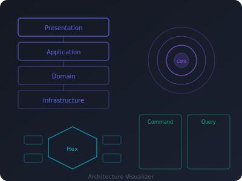

# Architecture Visualizer

Interactive visualizer for software architecture patterns — **MVC/MVP/MVVM**, **Layered**, **Clean**, **Hexagonal**, **CQRS**, **Event Sourcing**, **EDA**, **Microservices**, and **DDD**. Built with pure HTML5, CSS3, and vanilla JavaScript — no frameworks, no dependencies.



## Live Demo

[https://dykyi-roman.github.io/projects/architecture-visualizer/](https://dykyi-roman.github.io/projects/architecture-visualizer/)

## Features

### MVC / MVP / MVVM (3 Modes)

| Mode | Description |
|------|-------------|
| **MVC** | Controller receives user input, updates the Model. View observes Model changes and pulls data. Controller does NOT update the View directly |
| **MVP** | Presenter acts as mediator. View delegates all input to Presenter. Presenter updates Model and explicitly updates the passive View |
| **MVVM** | ViewModel exposes data via data binding. View binds to ViewModel properties and updates automatically. Two-way binding keeps them in sync |

### Layered Architecture (3 Modes)

| Mode | Description |
|------|-------------|
| **HTTP Request** | HTTP request enters through Controller in Presentation layer, passes Request DTO to UseCase, delegates to AppService and domain services, dispatches domain events through EventDispatcher |
| **Console Command** | Console command enters through CLI handler, delegates to AppService which orchestrates UseCase directly (no CommandBus). Dependencies always point inward |
| **Message Consumer** | Async message enters through a message consumer, AppService handles orchestration, UseCase executes domain logic and dispatches domain events |

### Clean Architecture (3 Modes)

| Mode | Description |
|------|-------------|
| **HTTP Request** | Request flows from external Framework layer inward through Interface Adapters to Use Cases and Entities. Dependency Rule: inner layers never depend on outer layers |
| **Console Command** | CLI adapter in the outer layer delegates inward to Use Cases. Same concentric ring structure with strict dependency direction |
| **Message Consumer** | Message adapter triggers Use Case execution through the same inward-only dependency flow |

### Hexagonal / Ports & Adapters (3 Modes)

| Mode | Description |
|------|-------------|
| **HTTP Request** | HTTP adapter (driving port) sends request through the port to Application Core, which uses driven ports for persistence and external services |
| **Console Command** | CLI adapter as a driving adapter, communicates with the core through ports. Core remains isolated from infrastructure |
| **Message Consumer** | Message adapter drives the application core through an inbound port, core delegates outbound operations through driven ports |

### CQRS (3 Modes)

| Mode | Description |
|------|-------------|
| **HTTP Request** | Command and Query paths are separated. Write side: Command → CommandBus → Handler → Aggregate → Event Store. Read side: Query → QueryBus → Handler → Read Model |
| **Console Command** | CLI dispatches Commands through the CommandBus to write-side handlers. Read model projections keep query side in sync |
| **Message Consumer** | Async message enters as a Command, processed through the write pipeline with event publication and read model synchronization |

### Event Sourcing (3 Modes)

| Mode | Description |
|------|-------------|
| **HTTP Request** | State is derived from a sequence of events. Command creates events stored in Event Store. Projections rebuild read models from the event stream |
| **Console Command** | CLI triggers command that produces domain events. Events are appended to the store, projections update materialized views |
| **Message Consumer** | Async message triggers event generation. Full audit trail maintained in Event Store with snapshot support for performance |

### Event-Driven Architecture (3 Modes)

| Mode | Description |
|------|-------------|
| **HTTP (Publish)** | HTTP request triggers an action that publishes a domain event to the Event Bus. Multiple consumers react independently with no direct coupling |
| **Choreography** | Services react to events independently without central coordination. Each service listens for relevant events and publishes new ones. Flow emerges from individual reactions |
| **Orchestration (Saga)** | Saga orchestrator coordinates the distributed transaction, sending commands to services and managing compensation on failure |

### Microservices Architecture (4 Modes)

| Mode | Description |
|------|-------------|
| **Sync (REST/gRPC)** | Synchronous request flows through the API Gateway to individual services. The gateway authenticates, routes, and aggregates responses. Services communicate via REST or gRPC through the gateway — never directly |
| **Async (Events)** | Event-driven communication between services via a Message Queue. Services publish domain events after state changes. Other services consume relevant events and react independently. No direct service-to-service calls |
| **Saga (Success)** | Successful distributed transaction coordinated by a Saga Orchestrator. Each step is a local transaction committed sequentially. All steps complete successfully and the order is fulfilled |
| **Saga (Failure)** | Failed saga with compensating transactions executed in reverse order. Payment fails after inventory is reserved, triggering compensations to restore consistency |

### Domain-Driven Design (7 Modes)

| Mode | Description |
|------|-------------|
| **HTTP Request** | Request flows through Presentation → Application → Domain layers. Aggregates enforce invariants, Domain Events propagate side effects, Repositories abstract persistence |
| **Console Command** | CLI entry point delegates to Application layer Use Cases which orchestrate Aggregate operations and Domain Services |
| **Message (Cross-Context)** | Domain Event from another Bounded Context arrives through the Anti-Corruption Layer, gets translated, and processed within the local context |
| **Context Map** | Bird's-eye view of all Bounded Contexts and their strategic relationships: ACL, Shared Kernel, Customer-Supplier, Conformist |
| **Open Host Service** | A context publishes a formal API (Open Host Service) with Published Language (OpenAPI/Protobuf). Multiple downstream contexts consume the same standardized contract |
| **Saga (Cross-Context)** | Saga/Process Manager coordinates a business process spanning multiple Bounded Contexts. Each context owns its local transaction; the Saga orchestrates the overall workflow and handles compensation on failure |
| **Domain Events** | A Domain Event propagates through the Event Bus to multiple contexts. Each consumer translates the event through its own ACL/Translator into its local Ubiquitous Language |

### Global Controls

| Control | Description |
|---------|-------------|
| **Send Request** | Execute a request flow through the selected architecture pattern |
| **Pause / Resume** | Freeze or resume the animation |
| **Reset** | Clear all state, counters, logs, and re-initialize current mode |
| **Step Mode** | Toggle step-by-step execution with Back/Next navigation. Can be entered from a paused animation to continue step-by-step |
| **Speed** | Adjustable animation speed: Slow, Normal, Fast, Ultra |

### Visualization Engine

- **Animated request flow** — step-by-step traversal through architecture layers with numbered steps
- **SVG arrow connectors** — curved Bezier paths drawn between components with directional arrowheads
- **Layer highlighting** — active layer glows during traversal, visited components retain visual state
- **Step indicators** — numbered badges on arrows and components showing execution order
- **Pattern description** — contextual description for the active mode
- **Dependency rules panel** — allowed (green) and forbidden (red) dependency directions per pattern
- **Collapsible Principles & Key Concepts** — pattern-specific principles and terminology
- **Collapsible Trade-offs panel** — Pros, Cons & When to Use for each pattern/mode
- **Color-coded event log** — timestamped entries with types: REQUEST, FLOW, COMMAND, EVENT, ERROR, RESPONSE. Supports Copy and Clear
- **Live stats bar** — Layers traversed, Components hit (cumulative across requests)
- **Architecture-specific color themes** — each pattern has its own accent color and dark background

### Architecture Color Themes

| Pattern | Accent | Background | Light |
|---------|--------|------------|-------|
| MVC | `#EF4444` | `#1f0d0d` | `#301515` |
| Layered | `#6366F1` | `#161830` | `#1e2248` |
| Clean | `#8B5CF6` | `#1a1630` | `#241e48` |
| Hexagonal | `#3B82F6` | `#0d1630` | `#152048` |
| CQRS | `#10B981` | `#0d1f18` | `#153024` |
| Event Sourcing | `#EC4899` | `#1f0d1a` | `#301524` |
| EDA | `#F97316` | `#1f150d` | `#302015` |
| Microservices | `#84CC16` | `#1a1f0d` | `#283015` |
| DDD | `#F59E0B` | `#1f1a0d` | `#302615` |

## Architecture

### Global Namespace Pattern

All modules register on a shared `ARCHV` object (`window.ARCHV`). Each architecture file creates a namespace (e.g., `ARCHV.layered`, `ARCHV.clean`) with a `modes` array, `depRules` array, `details` object, and mode objects. Each mode object exposes:

- `init()` — renders the architecture diagram with layers, components, and connectors
- `steps()` — returns an array of `{ elementId, label, description, logType, layerId }` objects that drive the animated flow
- `run()` — executes the request flow: animates step-by-step traversal, draws arrows, updates stats, logs events
- `stepOptions()` — returns options for step mode (e.g., `requestLabel`)

Each architecture also defines a `details` object with per-mode `tradeoffs` containing `pros`, `cons`, and `whenToUse` arrays.

### Application Lifecycle

```
DOMContentLoaded
  -> setupControls()              # bind Run, Pause, Reset, Speed, architecture tabs
  -> readHash() || switchArch('mvc')     # restore from URL hash or default to MVC
    -> renderModeTabs(archId)     # render mode buttons for selected architecture
    -> switchMode(archId, modeId) # clear state, call mode.init(), show dep rules
```

### Key Engine Components

| Component | Function | Description |
|-----------|----------|-------------|
| `ARCHV.state` | State management | Current architecture, mode, running/paused state, step delay, stats counters |
| `ARCHV.log()` | Event logging | Appends timestamped, type-coded entries to the event log panel |
| `ARCHV.clearLog()` | Clear log | Clears all entries from the event log |
| `ARCHV.copyLog()` | Copy log | Copies event log content to clipboard |
| `ARCHV.updateStats()` | Stats display | Updates the stats bar DOM with current counter values |
| `ARCHV.resetStats()` | Stats reset | Resets all counters (layers, components, deps, time, requests) to zero |
| `ARCHV.addStats()` | Stats increment | Increments layers, components, deps, and time counters |
| `ARCHV.nextRequestId()` | Request counter | Increments and returns the next request ID |
| `ARCHV.animateFlow()` | Flow animation | Async step-by-step traversal with arrow drawing, layer highlighting, and stats |
| `ARCHV.renderComponent()` | Component renderer | Generates `.archv-component` spans with icon, name, and optional tooltip |
| `ARCHV.renderArrowConnector()` | Connector renderer | Generates vertical arrow dividers between layers with optional labels |
| `ARCHV._drawArrow()` | Arrow drawing | SVG Bezier curve between two DOM elements with directional arrowheads |
| `ARCHV._edgePoint()` | Edge calculation | Finds where a line from rect center toward target exits the bounding rect |
| `ARCHV._drawStepBadge()` | Step badge | SVG numbered circle on the first step element |
| `ARCHV.showDependencyRules()` | Dependency rules | Renders allowed/forbidden dependency directions in the rules panel |
| `ARCHV.showTradeoffs()` | Trade-offs panel | Renders Pros, Cons & When to Use for current pattern/mode |
| `ARCHV.setAccentColors()` | Theming | Sets `--archv-accent`, `--archv-accent-bg`, `--archv-accent-light` CSS variables per architecture |
| `ARCHV.clearAnimations()` | Animation cleanup | Removes all SVG arrows, badges, and CSS animation classes |
| `ARCHV.ensureTooltips()` | Tooltip init | Initializes hover tooltips on components |
| `ARCHV.sleep()` | Pause support | Async delay with pause/resume capability |
| `ARCHV.pause()` | Pause animation | Sets paused state, resolves pending sleep |
| `ARCHV.resume()` | Resume animation | Clears paused state, resumes pending sleep |
| `ARCHV.startStepMode()` | Step mode start | Initializes step-by-step execution with optional resume from index |
| `ARCHV.stepForward()` | Step forward | Advances one step: highlights component, draws arrow, updates stats |
| `ARCHV.stepBack()` | Step back | Reverses one step: redraws previous state from scratch |
| `ARCHV.switchToStepMode()` | Pause-to-step | Converts a paused animation into step mode at the current step |
| `ARCHV.exitStepMode()` | Exit step mode | Cleans up step mode state and restores normal controls |

## Project Structure

```
architecture-visualizer/
├── index.html              # Layout shell: arch tabs, controls, stats, viz area, dep rules, log
├── css/
│   └── style.css           # Dark theme, architecture-specific colors, responsive (900px/600px)
├── js/
│   ├── engine.js           # ARCHV namespace, state, renderers, animations, SVG arrows, helpers
│   ├── mvc.js              # 3 modes: MVC, MVP, MVVM — triad component layout
│   ├── layered.js          # 3 modes: HTTP, Console, Message — vertical layer layout
│   ├── clean.js            # 3 modes: HTTP, Console, Message — concentric ring layout
│   ├── hexagonal.js        # 3 modes: HTTP, Console, Message — ports & adapters layout
│   ├── cqrs.js             # 3 modes: HTTP, Console, Message — separated read/write paths
│   ├── eventsourcing.js    # 3 modes: HTTP, Console, Message — event store & projections
│   ├── eda.js              # 3 modes: HTTP, Choreography, Orchestration — event mesh layout
│   ├── microservices.js    # 4 modes: Sync, Async, Saga Success, Saga Failure — gateway + services
│   ├── ddd.js              # 7 modes: HTTP, Console, Message, Context Map, OHS, Saga, Domain Events
│   └── app.js              # IIFE: architecture switching, mode tabs, control bindings, bootstrap
├── img.svg                 # Project preview image
└── README.md
```

### Script Load Order

Scripts must load in this exact order (each depends on the previous):

1. `engine.js` — defines `ARCHV` namespace and all shared utilities
2. `mvc.js` — registers `ARCHV.mvc` with MVC/MVP/MVVM triad layouts (default architecture)
3. `layered.js` — registers `ARCHV.layered` with modes and rendering functions
4. `clean.js` — registers `ARCHV.clean` with concentric ring visualization
5. `hexagonal.js` — registers `ARCHV.hexagonal` with ports & adapters layout
6. `cqrs.js` — registers `ARCHV.cqrs` with separated read/write paths
7. `eventsourcing.js` — registers `ARCHV.eventsourcing` with event store flow
8. `eda.js` — registers `ARCHV.eda` with event mesh and saga orchestration
9. `microservices.js` — registers `ARCHV.microservices` with gateway, services, and saga layout
10. `ddd.js` — registers `ARCHV.ddd` with DDD tactical and strategic patterns
11. `app.js` — IIFE that reads all `ARCHV.*` namespaces and wires up the UI

## Styling

### CSS Custom Properties

The project uses its own `--archv-*` CSS variable namespace (separate from the site's `--color-*` variables):

| Variable | Value | Purpose |
|----------|-------|---------|
| `--archv-bg` | `#141922` | Main background |
| `--archv-card-bg` | `#1a2030` | Card/panel background |
| `--archv-border` | `#2a3444` | Borders and dividers |
| `--archv-text` | `#e0e4ea` | Primary text |
| `--archv-text-light` | `#8892a4` | Secondary/muted text |
| `--archv-accent` | Dynamic | Set per architecture via `setAccentColors()` |
| `--archv-accent-bg` | Dynamic | Dark tinted background matching accent |
| `--archv-accent-light` | Dynamic | Light border matching accent |
| `--archv-radius` | `8px` | Border radius |
| `--archv-transition` | `0.25s ease` | Default transition |

### Responsive Breakpoints

- **> 900px** — full layout with side-by-side components and dependency rules panel
- **< 900px** — single column, stacked layers, simplified connectors
- **< 600px** — architecture tabs wrap, controls stack, compact stats bar

## Tech Stack

- **HTML5** — semantic markup with ARIA attributes (`role="tablist"`, `aria-selected`, `aria-expanded`, `aria-label`)
- **CSS3** — custom properties, grid layout, flexbox, CSS animations, dark theme
- **Vanilla JavaScript** — IIFE module in app.js, object literals for modes, async/await animations, SVG for arrow paths
- **No dependencies** — zero npm packages, zero CDN libraries

## Running Locally

```bash
# Any local HTTP server (required for fetch-based header loading)
python -m http.server 8000

# Then open
# http://localhost:8000/projects/architecture-visualizer/
```

## Author

**Dykyi Roman** — Software Engineer

- Website: [dykyi-roman.github.io](https://dykyi-roman.github.io/)
- GitHub: [dykyi-roman](https://github.com/dykyi-roman)
