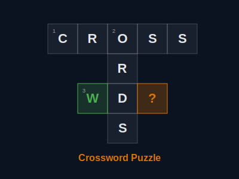

# Crossword Puzzle

Interactive crossword puzzle generator that fetches random English words from a public API and builds a playable crossword grid in the browser.



## Demo

[Play Online](https://dykyi-roman.github.io/projects/crossword/)

## How It Works

1. User selects the number of words (2–30) via a slider
2. Words with definitions are fetched from the [Datamuse API](https://www.datamuse.com/api/)
3. A crossword grid is generated using an intersection-based placement algorithm
4. Player fills in the grid using clues displayed in Across/Down columns

## Features

- **Dynamic generation** — every puzzle is unique, built from random API words
- **Auto-check on input** — words are validated as you type; solved words turn green
- **Check button** — highlights correct (green) and wrong (red) cells, reveals answers for unsolved clues
- **Keyboard navigation** — arrow keys, Tab to switch words, Backspace moves to previous cell
- **Clue interaction** — click a clue to jump to its word on the grid
- **Responsive design** — works on desktop, tablet, and mobile
- **No dependencies** — pure HTML, CSS, and vanilla JavaScript (ES modules)

## Project Structure

```
crossword/
├── index.html      # Page markup and controls
├── crossword.js    # Main orchestrator (rendering, input handling, state)
├── generator.js    # Crossword placement algorithm
├── api.js          # Datamuse API adapter (word + definition fetching)
├── style.css       # Crossword-specific styles (grid, clues, animations)
├── crossword.svg   # Preview image
└── README.md
```

## Algorithm

The placement algorithm (`generator.js`):

1. Sorts words by length (longest first)
2. Places the first word horizontally at origin
3. For each subsequent word, finds the best intersection with already-placed words
4. Validates placement: checks letter matches, parallel adjacency, and boundary cells
5. Normalizes coordinates to start at (0, 0)
6. Assigns sequential clue numbers (top-to-bottom, left-to-right)

## API

Words are sourced from [Datamuse](https://www.datamuse.com/api/) — a free word-finding API. The app queries words of lengths 4–8 with definitions (`?md=df`), filters out non-alphabetic entries, and shuffles the results.

## Running Locally

Serve from the repository root (required for header loading via fetch):

```bash
python -m http.server 8000
```

Then open `http://localhost:8000/projects/crossword/`.

## Author

**Dykyi Roman** — Software Engineer

- Website: [dykyi-roman.github.io](https://dykyi-roman.github.io/)
- GitHub: [dykyi-roman](https://github.com/dykyi-roman)