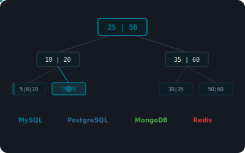

# Database Index Visualizer

Interactive visualizer for database index structures across **MySQL**, **PostgreSQL**, **MongoDB**, and **Redis**. Built with pure HTML5, CSS3, and vanilla JavaScript — no frameworks, no dependencies.



## Live Demo

[https://dykyi-roman.github.io/projects/db-visualizer/](https://dykyi-roman.github.io/projects/db-visualizer/)

## Features

### MySQL (5 Index Types)

| Mode | Description |
|------|-------------|
| **B-Tree Index** | B+Tree traversal: root -> internal nodes -> leaf -> data page. O(log n) lookup |
| **Hash Index** | Hash function maps key to bucket for O(1) equality-only lookups |
| **Composite Index** | Multi-column index with leftmost prefix rule: INDEX(a, b, c) |
| **Full-Text Index** | Inverted index with tokenization and posting lists for MATCH...AGAINST queries |
| **EXPLAIN Plan** | Query -> Parser -> Optimizer -> Index Selection -> Access Method visualization |

### PostgreSQL (5 Index Types)

| Mode | Description |
|------|-------------|
| **B-Tree** | B-Tree with MVCC visibility (xmin/xmax transaction IDs, dead tuples, VACUUM) |
| **Hash Index** | 4-page structure: meta page, bucket pages, overflow pages, bitmap pages |
| **GIN Index** | Generalized Inverted Index for JSONB, arrays, and full-text search |
| **GiST Index** | Generalized Search Tree for geometric/range data with bounding boxes |
| **BRIN Index** | Block Range Index storing min/max per block range for correlated data |

### MongoDB (4 Index Types)

| Mode | Description |
|------|-------------|
| **Single Field** | B-Tree index on a single document field with equality, range, and sort support |
| **Compound Index** | Multi-key compound index with prefix rule and sort optimization |
| **Multikey Index** | Array field indexing — one document creates multiple index entries |
| **Text Index** | Text search with stemming, stop word removal, and TF-IDF scoring |

### Redis (3 Index Types)

| Mode | Description |
|------|-------------|
| **Sorted Set (ZSET)** | Skip list + hash table with O(log n) insert/lookup by score |
| **Hash (Rehashing)** | Progressive rehashing with dual hash tables and bucket-by-bucket migration |
| **Secondary Index** | Sorted Sets as manual secondary indexes for numeric ranges and string prefixes |

### Common Controls

- **Run Query** — execute a query through the selected index structure
- **Burst** — run 5 queries rapidly in sequence
- **Index Miss** — next query bypasses the index (full table scan)
- **Reset** — clear all state, counters, and logs
- **Compare with Full Scan** — side-by-side comparison of index scan vs full table scan

### Visualization Engine

- Animated B+Tree traversal with node highlighting and fading
- Full table scan animation with row-by-row scanning
- Hash function visualization with bucket targeting
- Skip list level-based traversal for Redis ZSET
- Real-time stats bar: Pages Read, Rows Examined, Index Lookups, Query Time
- Color-coded event log with timestamps (QUERY, INDEX, SCAN, MISS, RESULT)
- Database-specific color themes (MySQL teal, PostgreSQL blue, MongoDB green, Redis red)
- Comparison panel showing index scan vs full scan performance

## Project Structure

```
db-visualizer/
├── index.html          # Main page with all UI markup
├── css/
│   └── style.css       # All visualizer styles, dark theme, responsive
├── js/
│   ├── engine.js       # Animation engine, B+Tree/Skip List renderers, stats, helpers
│   ├── mysql.js        # MySQL: B-Tree, Hash, Composite, Full-Text, EXPLAIN
│   ├── postgresql.js   # PostgreSQL: B-Tree (MVCC), Hash, GIN, GiST, BRIN
│   ├── mongodb.js      # MongoDB: Single Field, Compound, Multikey, Text
│   ├── redis.js        # Redis: Sorted Set, Hash Rehashing, Secondary Index
│   └── app.js          # Database switching, mode tabs, global controls
├── img.svg             # Project preview image
└── README.md
```

## Tech Stack

- **HTML5** — semantic markup with ARIA attributes for accessibility
- **CSS3** — custom properties, grid layout, flexbox, CSS animations
- **Vanilla JavaScript** — IIFE modules, async/await animations, SVG animation layer
- **No dependencies** — zero npm packages, zero CDN libraries

## Running Locally

```bash
# Any local HTTP server (required for fetch-based header loading)
python -m http.server 8000

# Then open
# http://localhost:8000/projects/db-visualizer/
```

## Author

**Dykyi Roman** — Software Engineer

- Website: [dykyi-roman.github.io](https://dykyi-roman.github.io/)
- GitHub: [dykyi-roman](https://github.com/dykyi-roman)