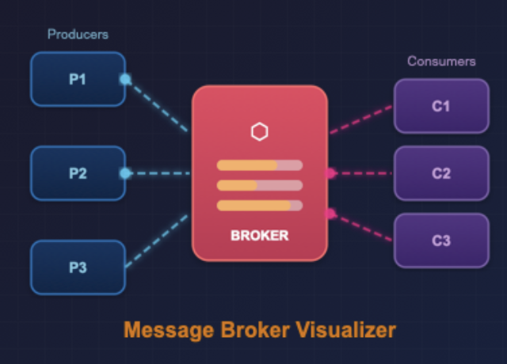

# Message Broker Visualizer

Interactive visualizer for three message brokers — **RabbitMQ**, **Apache Kafka**, and **Redis Pub/Sub**. Built with pure HTML5, CSS3, and vanilla JavaScript — no frameworks, no dependencies.



## Live Demo

[https://dykyi-roman.github.io/projects/message-broker-visualizer/](https://dykyi-roman.github.io/projects/message-broker-visualizer/)

## Features

### RabbitMQ (7 Tutorials)

| Mode | Pattern | Description |
|------|---------|-------------|
| **Hello World** | P -> Queue -> C | Simplest one-to-one messaging |
| **Work Queues** | Competing Consumers | Round-robin distribution across multiple workers with busy/ready states |
| **Pub/Sub** | Fanout Exchange | Broadcast every message to all bound queues simultaneously |
| **Routing** | Direct Exchange | Route messages by exact binding key match |
| **Topics** | Topic Exchange | Pattern-based routing with `*` (one word) and `#` (zero or more words) wildcards |
| **RPC** | Request/Reply | Synchronous call with `correlation_id` and temporary reply queues |
| **Publisher Confirms** | ACK/NACK | Broker acknowledges each message write; guarantees at-least-once delivery |

### Apache Kafka (4 Modes)

| Mode | Description |
|------|-------------|
| **Partitions** | Three partitioning strategies: Round-Robin, Key-Based (hash), Manual |
| **Consumer Groups** | Independent consumer groups with partition assignment and rebalancing |
| **Retention & Replay** | Persistent log with configurable retention and offset seek/replay |
| **Exactly-Once** | Delivery guarantees comparison: at-most-once, at-least-once, exactly-once |

### Redis (4 Modes)

| Mode | Description |
|------|-------------|
| **Pub/Sub** | Fire-and-forget channel messaging with connect/disconnect simulation |
| **Pattern Sub** | PSUBSCRIBE with glob patterns: `*`, `?`, `[abc]` |
| **Streams** | Persistent event log with consumer groups, XREADGROUP, XACK, and replay |
| **Event Sourcing** | State reconstruction by replaying events from an immutable stream log |

### Common Controls

- **Burst** — send 5 messages rapidly from all producers
- **Simulate Error** — next message triggers a broker NACK
- **Pause / Resume** — freeze all animations and queue processing
- **Reset** — clear all state, counters, and logs
- **Publisher Confirms toggle** — enable ACK/NACK feedback on any RabbitMQ mode

### Visualization Engine

- Animated message dots flying along cubic Bezier curves between producers, broker, and consumers
- Real-time throughput chart (canvas-based, last 24 seconds)
- Color-coded event log with timestamps (SEND, ROUTE, RECV, ACK, NACK, ERROR, REPLY, CONFIRM, SEEK, PMATCH)
- Live stats bar: Sent, Delivered, In Queue, msg/sec
- Broker-specific color themes (RabbitMQ orange, Kafka blue, Redis red)

## Project Structure

```
message-broker-visualizer/
├── index.html          # Main page with all UI markup
├── css/
│   └── style.css       # All visualizer styles (~1300 lines), dark theme, responsive
├── js/
│   ├── engine.js       # Animation engine, event log, stats, message routing helpers
│   ├── rabbitmq.js     # RabbitMQ tutorials 1-7 implementation
│   ├── kafka.js        # Kafka partitions, consumer groups, retention, exactly-once
│   ├── redis.js        # Redis Pub/Sub, pattern matching, streams, event sourcing
│   └── app.js          # Broker switching, mode tabs, global controls
├── img.png             # Project preview image
└── tasks/
    └── message-broker-visualizer-full-tasks.md  # Full specification (20 tasks)
```

## Tech Stack

- **HTML5** — semantic markup with ARIA attributes for accessibility
- **CSS3** — custom properties, grid layout, flexbox, CSS animations (shake, pulse, fade)
- **Vanilla JavaScript** — IIFE modules, `requestAnimationFrame` for animations, Canvas API for throughput chart
- **No dependencies** — zero npm packages, zero CDN libraries

## Running Locally

```bash
# Any local HTTP server (required for fetch-based header loading)
python -m http.server 8000

# Then open
# http://localhost:8000/projects/message-broker-visualizer/
```

## Responsive Design

- **> 900px** — full 3-column grid (producers | broker | consumers)
- **< 900px** — single column, horizontal card layout, connection ports hidden
- **< 600px** — stacked broker tabs, wrapped stats bar

## Author

**Dykyi Roman** — Software Engineer

- Website: [dykyi-roman.github.io](https://dykyi-roman.github.io/)
- GitHub: [dykyi-roman](https://github.com/dykyi-roman)