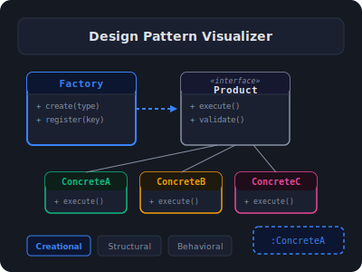

# Design Pattern Visualizer

Interactive visualizer for GoF **Creational** design patterns with animated UML class diagrams, object creation flows, and step-by-step execution. Built with pure HTML5, CSS3, and vanilla JavaScript — no frameworks, no dependencies.



## Live Demo

[https://dykyi-roman.github.io/projects/pattern-visualizer/](https://dykyi-roman.github.io/projects/pattern-visualizer/)

## Implemented Patterns

### Creational (8 patterns)

| Pattern | Mode | Description |
|---------|------|-------------|
| **Simple Factory** | Transport | `TransportFactory.create(type)` returns Truck, Ship, or Plane — client never uses `new` on concrete classes |
| **Static Factory** | Number | `Number.of(value)` returns Integer, Float, or BigDecimal; small integers are cached (flyweight) |
| **Factory Method** | Logistics | Abstract `Logistics` class delegates `createTransport()` to subclasses — `RoadLogistics` returns Truck, `SeaLogistics` returns Ship |
| **Abstract Factory** | Furniture | `FurnitureFactory` interface creates matching Chair + Table + Sofa families; `ModernFactory` and `VictorianFactory` guarantee variant consistency |
| **Builder** | House | `Director` orchestrates foundation → walls → roof → interior steps; `WoodenHouseBuilder` and `StoneHouseBuilder` produce different representations |
| **Prototype** | Shapes | `clone()` on Circle, Rectangle, Triangle produces a fully independent deep copy without depending on concrete classes |
| **Singleton** | Database | `DatabaseConnection.getInstance()` — lazy init, single instance shared across all clients |
| **Object Pool** | Database | `ConnectionPool.acquire()` / `release()` — fixed set of reusable connections moved between Available and In Use pools |

### Structural & Behavioral

Coming soon — tabs visible in the category bar but disabled.

## Controls

| Control | Description |
|---------|-------------|
| **Run** | Start the pattern animation |
| **Pause / Resume** | Freeze or resume mid-animation |
| **Reset** | Clear state, log, and re-initialize current mode |
| **Step Mode** | Toggle step-by-step execution with Back / Next navigation. Can also be entered from a paused animation |
| **Speed** | Adjustable: Slow (100–300ms), Normal (300–700ms), Fast (700–1000ms), Ultra (>1000ms). Persisted in `localStorage` |

URL hash encodes the active pattern and mode (e.g., `#builder/house`), enabling deep links and browser back/forward.

## Visualization Engine

- **UML class diagram** — boxes for classes (stereotype badges for `interface`/`abstract`), method lists, hover tooltips
- **Runtime objects** — dashed-border boxes showing live instances created during animation
- **SVG relation lines** — inheritance, composition, and dependency arrows drawn as Bezier curves on an overlay `<svg>` layer
- **Animated flow** — objects highlight as `pv-active` → `pv-visited`; spawned objects animate as `pv-spawned`
- **Step indicators** — numbered badges on elements showing execution order
- **Per-pattern color themes** — accent color, background, and border color set via CSS variables per pattern switch
- **Pattern description** — contextual text for the active mode
- **Collapsible Principles & Key Concepts** — principles list + glossary grid
- **Collapsible Trade-offs** — Pros, Cons & When to Use for each pattern
- **Pattern Participants panel** — roles of each participant (Factory, Product, Concrete Product, Client)
- **Event Log** — timestamped entries with Copy / Clear. Log types: `REQUEST`, `CREATE`, `CALL`, `RETURN`, `INFO`, `ERROR`
- **Live stats bar** — Steps and Objects counters (cumulative per session)

## Architecture

### Global Namespace

All modules attach to `window.PV`. Each pattern file registers `PV['{pattern}']` with:

- `modes` — array of `{ id, label, desc }` mode descriptors
- `depRules` — array of `{ name, role }` participant descriptions shown in the Participants panel
- `details` — object keyed by `modeId` with `principles[]`, `concepts[]`, and `tradeoffs` (`pros`, `cons`, `whenToUse`) for the collapsible panels
- `PV['{pattern}']['{modeId}']` — mode object with:
  - `init()` — renders the UML diagram (classes, objects, static relations)
  - `run()` — async animation: highlights active elements, draws arrows, logs events, updates stats
  - `steps()` — returns `{ elementId, label, logType }` array for step mode
  - `stepOptions()` — optional extra options for step mode initialization

### Application Lifecycle

```
DOMContentLoaded + I18N.onReady()
  -> setupControls()               # bind Run, Pause, Reset, Speed, Step Mode
  -> readHash() || switchPattern('simple-factory')
    -> renderModeTabs(patternId)   # render mode buttons
    -> switchMode(patternId, modeId)
      -> config.initMode(modeId)  # call PV[pattern][mode].init()
      -> updatePatternDetails()   # render Principles, Concepts, Trade-offs
      -> PV.showParticipants()    # render dep rules panel
```

`window.PV_refresh()` is registered for the `I18N` language switcher — re-translates tabs and re-initializes the current pattern/mode.

### Key Engine Functions

| Function | Description |
|----------|-------------|
| `PV.renderClass(id, name, opts)` | Generates `.pv-class` HTML with stereotype, methods list, tooltip |
| `PV.renderObject(id, label, opts)` | Generates `.pv-object` dashed box for runtime instances |
| `PV.renderRelation(fromId, toId, type)` | Draws SVG inheritance / composition / dependency arrow |
| `PV.renderArrowConnector(label)` | Inline horizontal arrow divider for flow layouts |
| `PV.animateCreate(id)` | Marks element as `pv-spawned`, increments `objectsCreated` stat |
| `PV.animateFlow(steps, reqId)` | Async traversal: highlight, sleep, check abort |
| `PV.setAccentColors(patternId)` | Sets `--pv-accent`, `--pv-accent-bg`, `--pv-accent-light` CSS variables |
| `PV.showParticipants(rules, i18nKey)` | Renders participant role cards |
| `PV.showTradeoffs(tradeoffs, i18nPrefix)` | Renders Pros/Cons/When-to-Use panel |
| `PV.startStepMode(steps, opts)` | Initializes step-by-step mode |
| `PV.stepForward()` / `PV.stepBack()` | Advance or rewind one step |
| `PV.sleep(ms)` | Async delay with pause/resume support |
| `PV.log(type, text)` | Appends timestamped entry to the event log |

### Pattern Color Themes

| Pattern | Accent | Background |
|---------|--------|------------|
| Simple Factory | `#3B82F6` | `#0d1630` |
| Static Factory | `#84CC16` | `#1a1f0d` |
| Factory Method | `#8B5CF6` | `#1a1630` |
| Abstract Factory | `#6366F1` | `#161830` |
| Builder | `#F59E0B` | `#1f1a0d` |
| Prototype | `#10B981` | `#0d1f18` |
| Singleton | `#EC4899` | `#1f0d1a` |
| Object Pool | `#F97316` | `#1f150d` |

## Internationalization

Translations are loaded via `window.I18N` from two JSON tiers:

- `resources/i18n/ui.{lang}.json` — shared UI strings (buttons, labels, legend)
- `projects/pattern-visualizer/i18n/{lang}.json` — pattern names, mode descriptions, principles, concepts, trade-offs

Supported languages: **en, ru, fr, de, es**. Language is detected from `?lang=` URL param → `localStorage['i18n-lang']` → `navigator.language`.

All translatable strings in JS use `I18N.t(key, params, fallback)`. DOM elements use `data-i18n`, `data-i18n-title`, `data-i18n-placeholder` attributes.

## Project Structure

```
pattern-visualizer/
├── index.html              # Layout shell: category bar, pattern tabs, controls, viz area, log
├── css/
│   └── style.css           # Dark theme, per-pattern color vars (--pv-*), responsive (900px/600px)
├── js/
│   ├── engine.js           # PV namespace, state, renderers, SVG arrows, step mode, helpers
│   ├── simple-factory.js   # 1 mode: Transport — single create() method
│   ├── static-factory.js   # 1 mode: Number — named constructors with caching
│   ├── factory-method.js   # 1 mode: Logistics — abstract creator with subclass override
│   ├── abstract-factory.js # 1 mode: Furniture — product families (Modern, Victorian)
│   ├── builder.js          # 1 mode: House — Director + step-by-step construction
│   ├── prototype.js        # 1 mode: Shapes — clone() with deep copy
│   ├── singleton.js        # 1 mode: Database — lazy single instance
│   ├── pool.js             # 1 mode: Database — acquire/release pool lifecycle
│   └── app.js              # IIFE: pattern/mode switching, controls, bootstrap, PV_refresh
├── i18n/
│   ├── en.json             # English (authoritative — all keys required)
│   ├── ru.json             # Russian
│   ├── de.json             # German
│   ├── es.json             # Spanish
│   └── fr.json             # French
└── img.svg                 # Project preview image
```

### Script Load Order

```
engine.js → simple-factory.js → static-factory.js → factory-method.js
  → abstract-factory.js → builder.js → prototype.js → singleton.js → pool.js → app.js
```

`app.js` must load last — it reads all `PV['{pattern}']` namespaces registered by the pattern files.

## CSS Custom Properties

The project uses its own `--pv-*` namespace (independent of the site's `--color-*` variables):

| Variable | Default | Purpose |
|----------|---------|---------|
| `--pv-bg` | `#141922` | Page background |
| `--pv-card-bg` | `#1a2030` | Panel / card background |
| `--pv-border` | `#2a3444` | Borders |
| `--pv-text` | `#e0e4ea` | Primary text |
| `--pv-text-light` | `#8892a4` | Muted text |
| `--pv-accent` | Dynamic | Set per pattern via `setAccentColors()` |
| `--pv-accent-bg` | Dynamic | Dark tinted background matching accent |
| `--pv-accent-light` | Dynamic | Light border matching accent |

## Adding a New Pattern

1. Create `js/{pattern-name}.js` — register `PV['{pattern-name}']` with `modes`, `depRules`, `details`, and mode objects (`init`, `run`, `steps`)
2. Add translations to `i18n/en.json` (then replicate keys to other language files)
3. Add `<script src="js/{pattern-name}.js"></script>` to `index.html` before `app.js`
4. Register the pattern in `app.js` `patternConfigs` object
5. Add a `<button class="pv-tab" data-pattern="{pattern-name}">` in `index.html`
6. Add theme colors in `engine.js` `PV.setAccentColors()` themes map

## Running Locally

```bash
# HTTP server required for fetch-based header and i18n loading
python -m http.server 8000
# Open http://localhost:8000/projects/pattern-visualizer/
```

## Author

**Dykyi Roman** — Software Engineer

- Website: [dykyi-roman.github.io](https://dykyi-roman.github.io/)
- GitHub: [dykyi-roman](https://github.com/dykyi-roman)