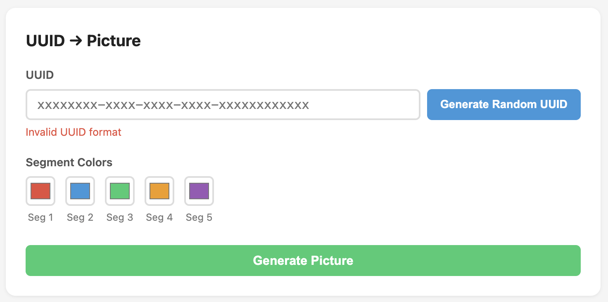
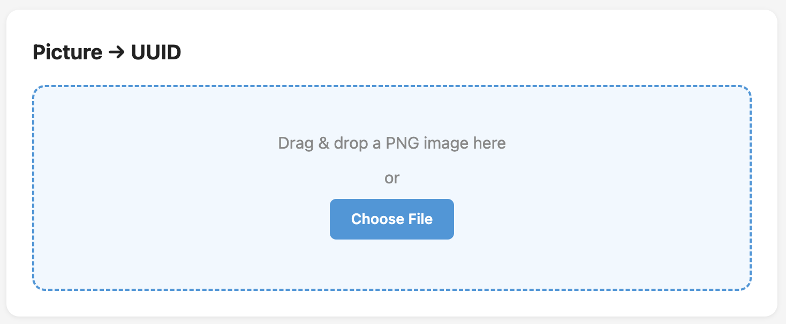

# UUID to Picture

Convert UUIDs into unique visual dot-matrix images and decode them back. Each UUID produces a deterministic, color-coded picture that can be exported as PNG or SVG.


## How It Works

A UUID (`xxxxxxxx-xxxx-xxxx-xxxx-xxxxxxxxxxxx`) consists of 32 hex characters split into 5 segments. Each hex character (0-F) maps to a 2x2 dot matrix using its 4 binary bits:

```
Hex "A" = 1010 binary

  bit3  bit2       [filled]  [empty]
  bit1  bit0   =>  [filled]  [empty]
```

The 32 hex characters fill a 12x12 dot grid (6x6 cells of 2x2 dots each), with 4 padding cells completing the square. Each of the 5 UUID segments is rendered in a distinct color.

### Grid Layout

| Row | Content | Color |
|-----|---------|-------|
| 0 | Segment 1 chars 0-5 | Red |
| 1 | Segment 1 chars 6-7, Segment 2 chars 0-3 | Red + Blue |
| 2 | Segment 3 chars 0-3, Segment 4 chars 0-1 | Green + Orange |
| 3 | Segment 4 chars 2-3, Segment 5 chars 0-3 | Orange + Purple |
| 4 | Segment 5 chars 4-9 | Purple |
| 5 | Segment 5 chars 10-11, padding x4 | Purple |

## Features

**Encode (UUID to Picture)**
- Enter or generate a random UUID v4
- Customize colors for each of the 5 segments
- Real-time re-rendering on color change
- Export as PNG or SVG



**Decode (Picture to UUID)**
- Drag & drop or select a PNG image
- Automatic grid detection and hex reconstruction
- Confidence score display
- Copy decoded UUID to clipboard



## Project Structure

```
uuid-to-picture/
├── index.html              # Main page
├── css/style.css           # Component styles
├── js/
│   ├── uuid.js             # UUID validation, parsing, generation
│   ├── encoder.js          # UUID → GridModel (hex to 2x2 dot matrices)
│   ├── decoder.js          # PNG image → UUID (pixel sampling + reconstruction)
│   ├── canvas-renderer.js  # GridModel → Canvas (PNG export)
│   ├── svg-renderer.js     # GridModel → SVG string (SVG export)
│   └── app.js              # UI wiring and event handlers
├── docs/                   # Screenshots and examples
├── package.json            # Dev tooling (eslint, prettier)
└── eslint.config.js        # Linting configuration
```

## Development

```bash
# Serve locally
npx serve .

# Lint
npm run lint

# Format
npm run format
```

No build step required — pure vanilla JavaScript with ES modules (IIFE pattern).

## Technical Details

- **Grid**: 12x12 dots (6x6 cells), each cell is a 2x2 dot matrix
- **Rendering**: `dotRadius: 8px`, `dotGap: 2px`, `padding: 1px`
- **Decoding**: Brightness threshold (RGB > 200) distinguishes filled vs empty dots
- **Deterministic**: Same UUID + same colors = identical image every time

## License

MIT

## Author

**Dykyi Roman** — Software Engineer

- Website: [dykyi-roman.github.io](https://dykyi-roman.github.io/)
- GitHub: [dykyi-roman](https://github.com/dykyi-roman)